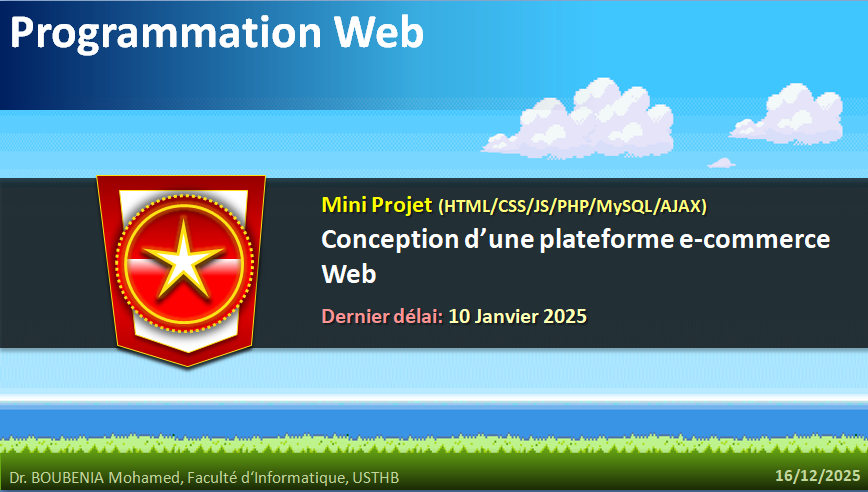

# 🛒 Mini-Projet – Conception d’une plateforme e-commerce Web

## 🌐 Préambule — Pourquoi ce projet ?

Les plateformes e-commerce sont parmi les **applications Web les plus complexes et les plus utilisées** au monde.  
Elles combinent à la fois :
- gestion des utilisateurs,
- sécurité,
- persistance des données,
- logique métier,
- performance,
- et expérience utilisateur.

Ce mini-projet vous place dans une **situation proche d’un contexte professionnel réel** :  
concevoir une **application e-commerce complète**, depuis la base de données jusqu’à l’interface utilisateur, en respectant les **principes d’architecture Web modernes**.

---

## 🧠 Intitulé du mini-projet

### **Concevoir et développer une plateforme e-commerce Web**

---

## 🎯 Objectifs pédagogiques

À l’issue de ce mini-projet, vous serez capables de :

- Concevoir une **architecture Web complète** (frontend / backend)
- Implémenter une **logique métier e-commerce**
- Gérer l’**authentification** et les **rôles utilisateurs**
- Manipuler **cookies et sessions**
- Interagir avec une **base de données**

### Technologies attendues
- **HTML / CSS**
- **JavaScript**
- **HTTP**
- **PHP**
- **AJAX**
- **Web Services REST**
- **Base de données (MySQL)**

---

## 📌 Principe général du projet

Chaque équipe doit développer un **site Web e-commerce fonctionnel**, permettant la vente d’un type d’item **librement choisi**  
(exemples : livres, produits électroniques, vêtements, équipements sportifs, etc.).

---
---

## 🧑‍🤝‍🧑 Travail en équipe & Git

- Le projet se réalise **en équipe**
- Chaque équipe doit créer un **compte GitHub** portant le nom :
pravan_2025_team_X

👉 Le numéro `X` de chaque équipe est fourni dans:
https://docs.google.com/spreadsheets/d/1V4Tjh3S1lrXuGrPJDkl9YSHlWG5u-_uKOngrlVyUb00/edit?gid=0#gid=0

### Dépôt Git
- Chaque équipe doit :
  - Cloner le dépôt du mini-projet
  - Travailler avec **le compte de l’équipe**
  - Pusher régulièrement le code (comment ce qu'on faisait en TP)
  
---

## 🧩 Fonctionnalités obligatoires

### 🏪 Boutique
- Une **page principale** présentant les items disponibles à la vente
- Chaque item doit contenir :
  - un **nom**
  - une **description**
  - un **prix**
- Les items doivent être **chargés depuis une base de données**

---

### 🔍 Recherche & filtrage
- Mise en place d’un **moteur de recherche**
- Filtrage selon **plusieurs critères** :
  - prix
  - catégorie
  - mot-clé
  - autres critères pertinents

---

### 📄 Page détail d’un item
- Consultation d’une **page dédiée** à chaque item
- Affichage détaillé :
  - description complète
  - prix
  - option d’ajout au panier

---

### 👤 Authentification utilisateur
- Possibilité pour un utilisateur de :
  - se **connecter**
  - se **déconnecter**
- Gestion des **sessions**
- Utilisation des **cookies**

---

### 🛍️ Panier
- Ajouter un item au panier
- Supprimer un item du panier
- Consulter l’état du panier :
  - items sélectionnés
  - quantités
  - total

---

### 🔐 Administration
- Connexion d’un **administrateur**
- Interface permettant à l’administrateur de :
  - ajouter de nouveaux items
  - modifier les items existants
  - supprimer des items

⚠️ L’accès aux fonctionnalités d’administration doit être **strictement protégé**.

---

## 🗄️ Base de données

La base de données doit contenir au minimum :
- une table `users`
- une table `items`
- une table `cart` (ou équivalent)
- une gestion des rôles (`user`, `admin`)

Le schéma doit être **documenté** et **justifié**.

## ⏰ Date limite de remise

📅 **10 janvier 2026**  
🕛 **à minuit (23h59)**

---

## 🚀 Ce que vous allez vraiment apprendre

